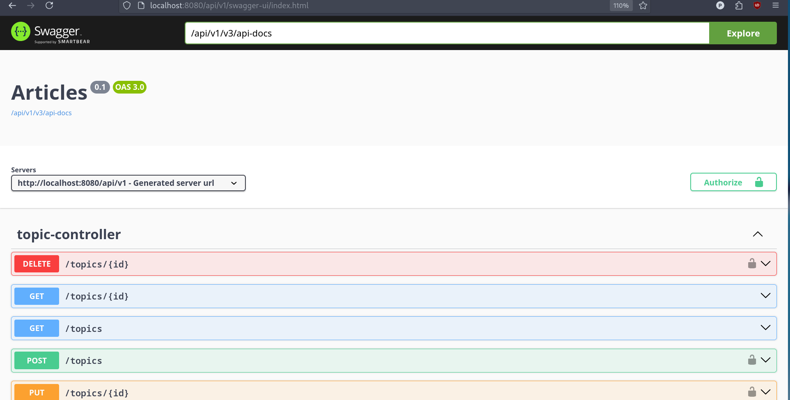
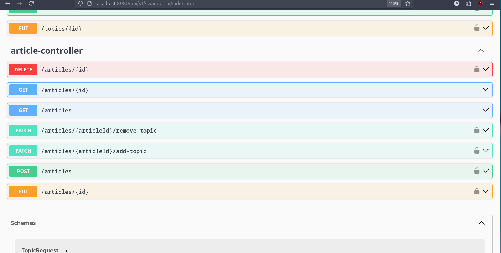
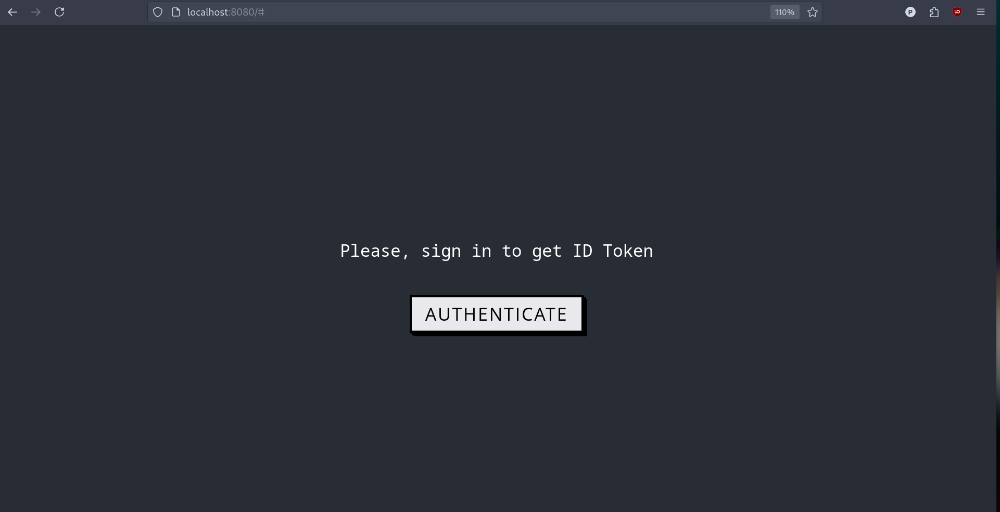
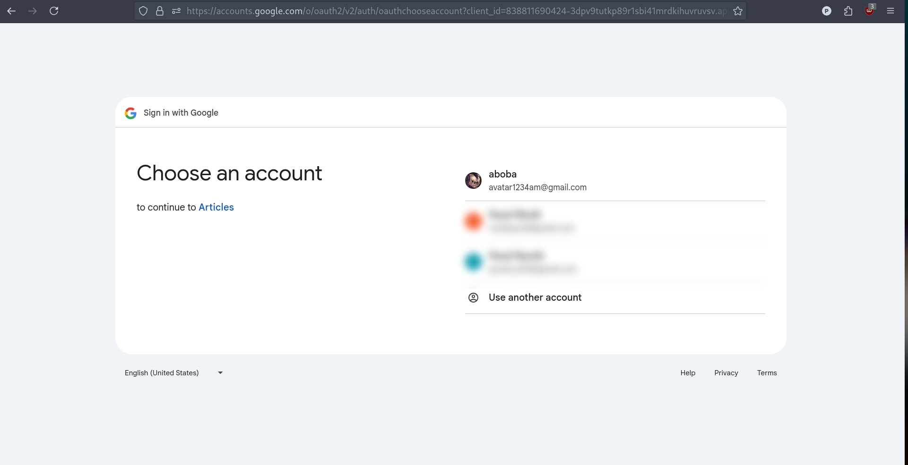
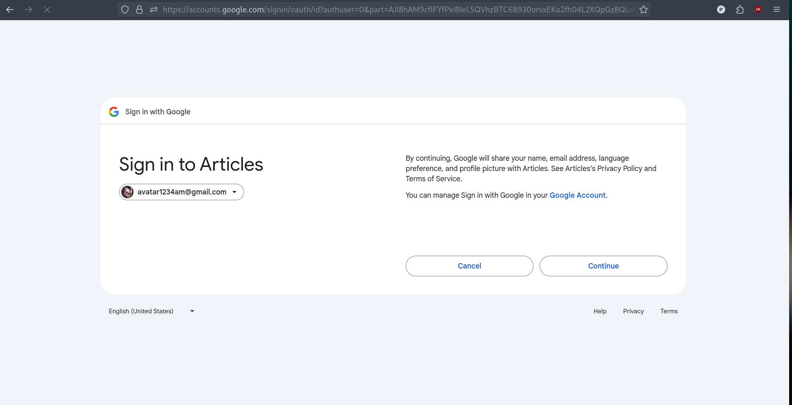
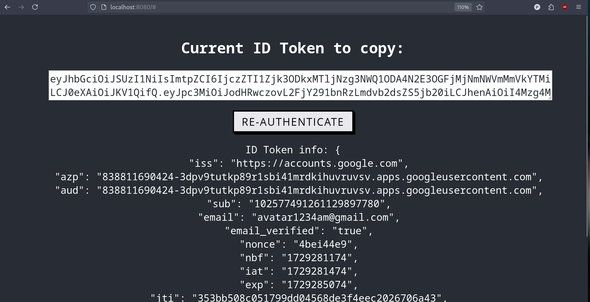

# Articles

---

Back-end web-приложение, содержащее статьи разных тематик. Можно проводить поиск статей по тематикам, ключевым словам
имеющимся в заголовках и внутри самих статей (ключевые слова могут быть написаны с ошибками). 

Изменения, относящиеся к статьям, транслируются через Kafka в Elasticsearch. Для обеспечения гарантий согласованности 
при потенциальных сбоях java-приложения, используется оркестратор микросервисов Temporal (приложение может оказаться в 
несогласованном состоянии, если не используется оркестратор и сбой сервера произошел когда изменение статьи 
уже зафиксировано в базе данных, но еще не отправлено на Kafka-топик).
При создании статей и тематик используется токен идемпотентности, а при обновлении поле version.

Для получения доступа к статьям и для их поиска по ключевым словам либо тематикам аутентификация не требуется.
Для публикации статей требуется аутентификация.

Регистрация и аутентификация в приложении осуществляется через аутентификацию в Google (OIDC), с помощью фронтенда по 
адресу http://localhost:8080/ (см. [Процесс аутентификации](#процесс-аутентификации)). 

Rest API по адресу: http://localhost:8080/api/v1/.

Swagger по адресу http://localhost:8080/api/v1/swagger-ui.html (см. [скриншоты Swagger ниже](#swagger)).

Используемые технологии:
- Java 21 & Spring Boot
- Elasticsearch
- PostgreSQL
- Apache Kafka
- Temporal (Orchestrator)
- Nginx (Api-gateway)

---

Используемые фреймворки/библиотеки:
- Spring Boot 3.3.1
- Spring Web MVC 
- gRPC
- Spring Data JPA
- Spring Data Elasticsearch
- Spring Kafka
- Spring Validation
- Spring OAuth2 Resource Server
- Hibernate 6.5.2
- Temporal SDK
- MapStruct
- Liquibase
- Lombok

---

Используемые фреймворки/библиотеки для тестирования:
- JUnit5
- Spring-test
- Mockito
- Testcontainers
- Wiremock
- Temporal-testing

---

Написан спринг бут стартер, создающий схемы индексов в Elasticsearch, если соответствующие индексы отсутствуют.

---

## Инструкции по запуску

0. Иметь 6гб свободной оперативной памяти, т.к. требуется запустить 10 докер контейнеров (см. [docker-compose.yml](./docker/docker-compose.yml)).
---

1. Создание jar-архивов для микросервисов текущего проекта:
`./gradlew :prepareForDocker`

---
2. Запуск контейнеров и ожидание пока они придут в готовность (примерно 30 сек - 1 минута)


```bash 
(cd ./docker && docker compose down -v && docker compose build && docker compose up) # Linux 
```
---

3. Переход на http://localhost:8080 и [аутентификация](#процесс-аутентификации) через Google, чтобы получить jwt token.

Переход на http://localhost:8080/api/v1/swagger-ui.html и вызов соответствующих endpoint-ов 
через интерфейс Swagger.

---

4. (Опционально после завершения работы) Удаление контейнеров, сетей, volume-ов: 
```bash
(cd ./docker && docker compose down -v) # Linux
```

## Swagger



## Процесс аутентификации:





