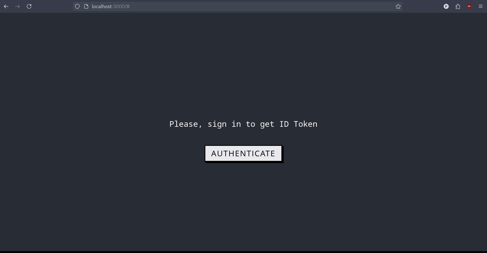
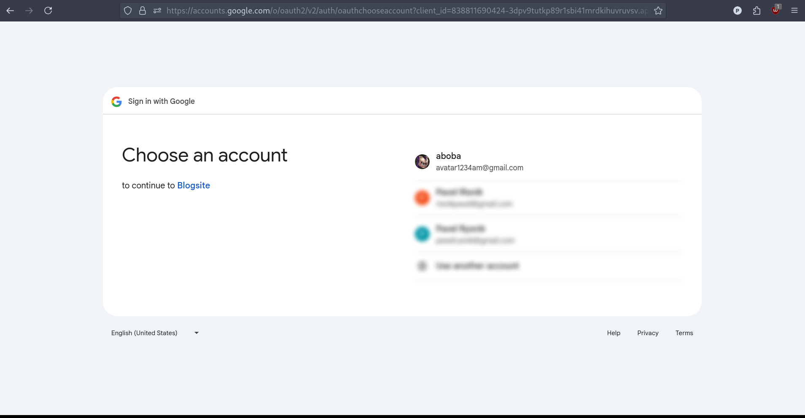
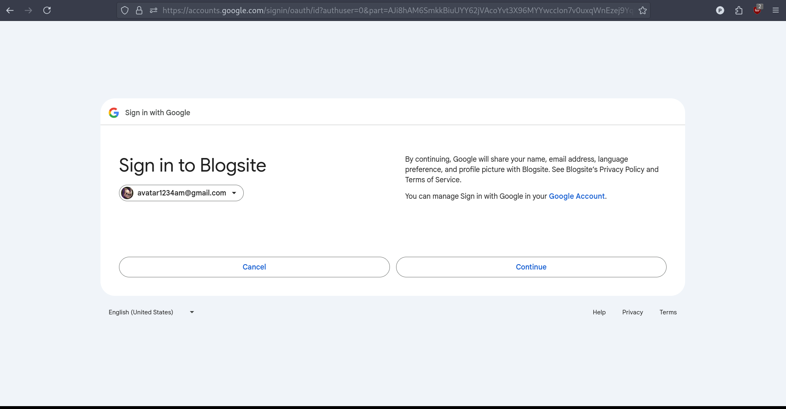
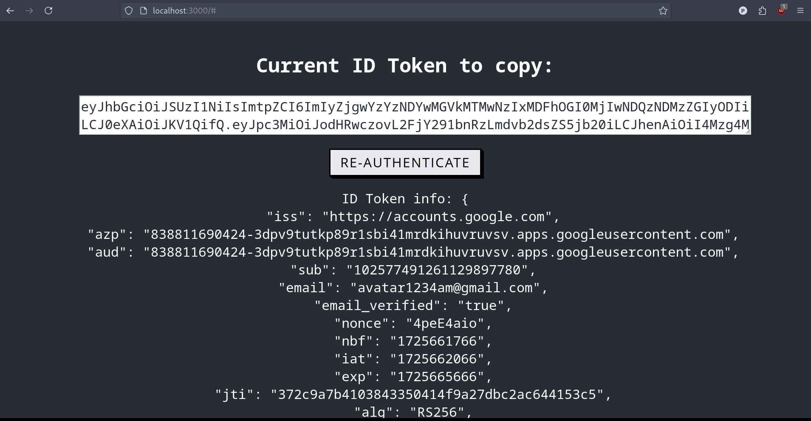

<h1>Blogsite (backend)</h1>

Backend web-приложения аналогичного <a href="https://habr.com">Хабр</a>, <a href="https://medium.com">Medium</a> 

 Используемые фреймворки/библиотеки для продакшена

<ul>
    <li>Spring Boot 3.3.1</li>
    <li>Spring Web MVC</li>
    <li>gRPC</li>
    <li>Spring Data JPA</li>
    <li>Spring Data Elasticsearch</li>
    <li>Spring Validation</li>
    <li>Spring OAuth2 Resource Server</li>
    <li>Hibernate 6.5.2</li>
    <li>MapStruct</li>
    <li>Liquibase</li>
    <li>Lombok</li>
</ul>

 Используемые фреймворки/библиотеки для тестирования

<ul>
    <li>JUnit5</li>
    <li>AssertJ</li>
    <li>Spring Boot Test</li>
    <li>Mockito</li>
    <li>Testcontainers</li>
    <li>H2</li>
    <li>Wiremock</li>
</ul>

Используемые технологии

<ul>
    <li>Java 21 & Gradle (Kotlin)</li>
    <li>PostgreSQL 16</li>
    <li>Elasticsearch 8</li>
</ul>

Создан удобный frontend на React для получения токенов аутентификации от Google,
которые нужны для вызова некоторых HTTP-эндпоинтов. Скриншоты: 

Написан спринг бут стартер, создающий схемы индексов в Elasticsearch, если индексы с такими названиями отсутствуют.
(RestClient + Elasticsearch REST API) 

